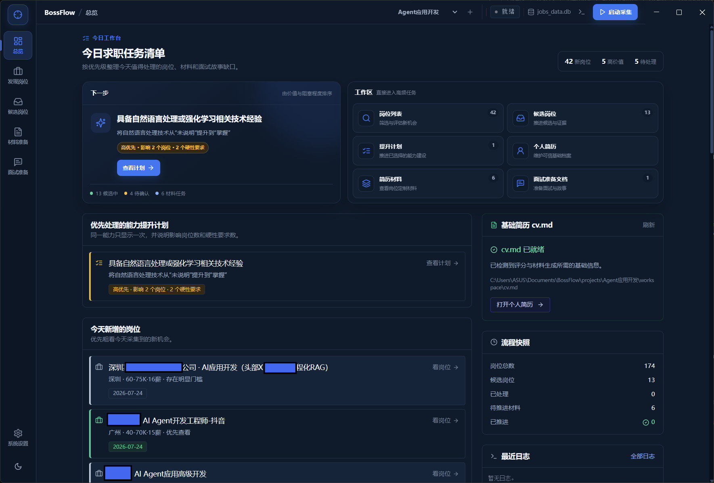
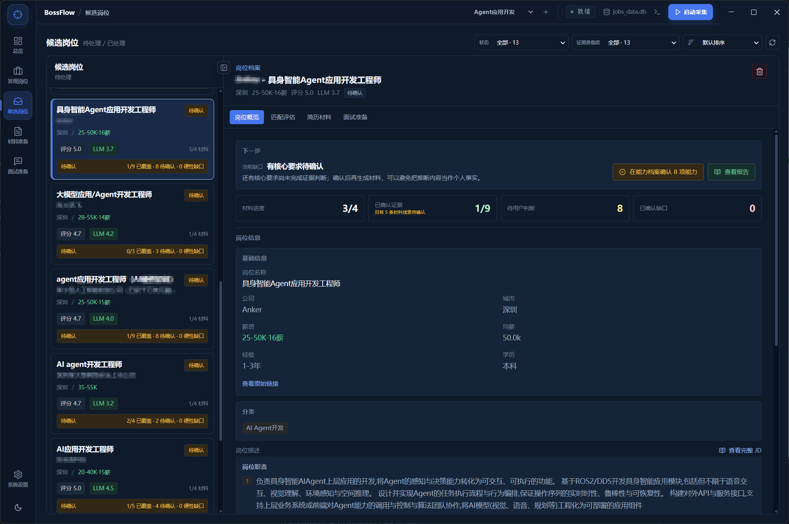
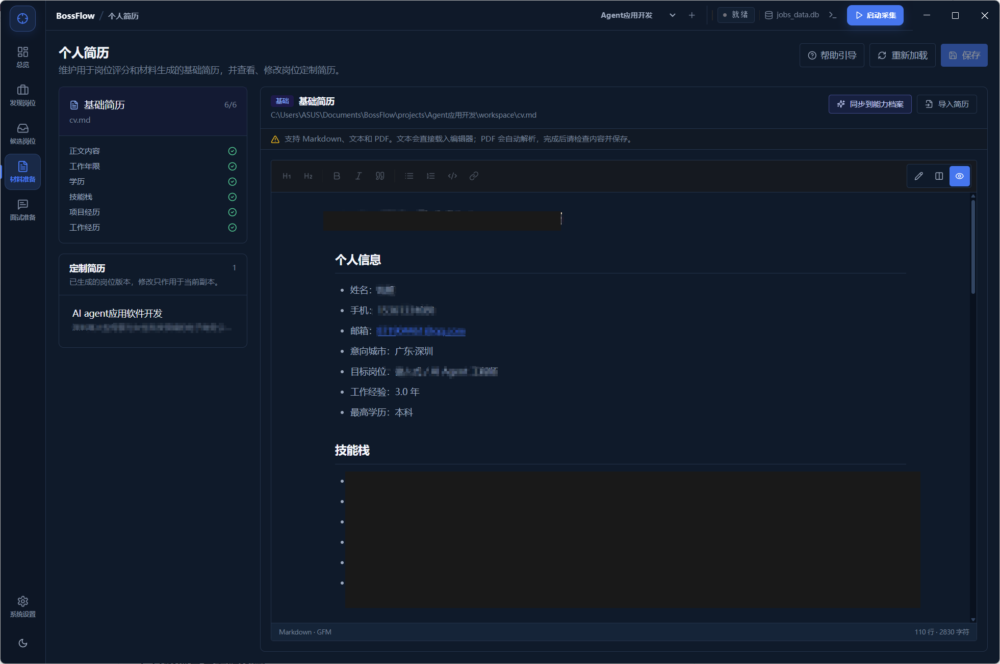
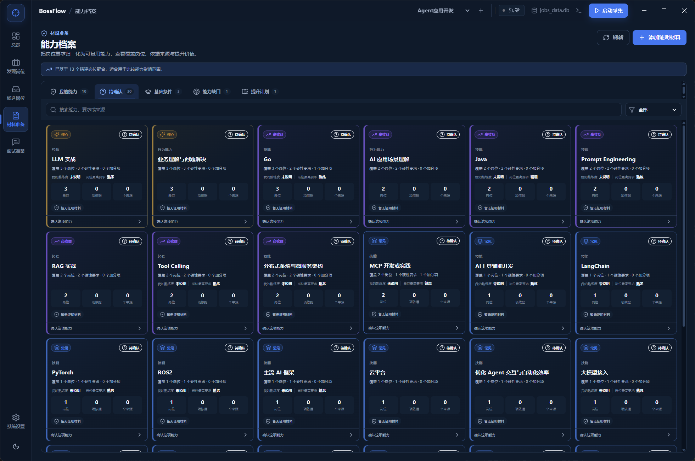
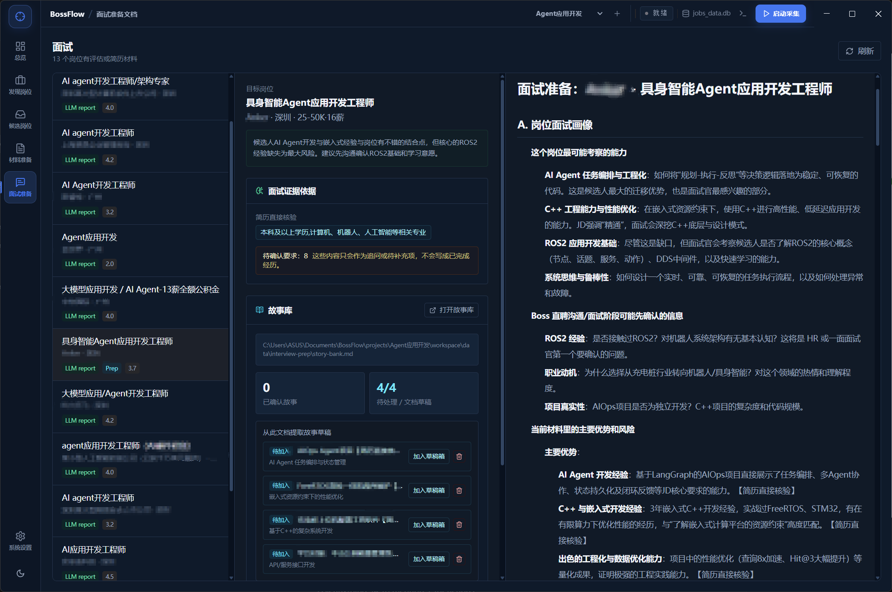
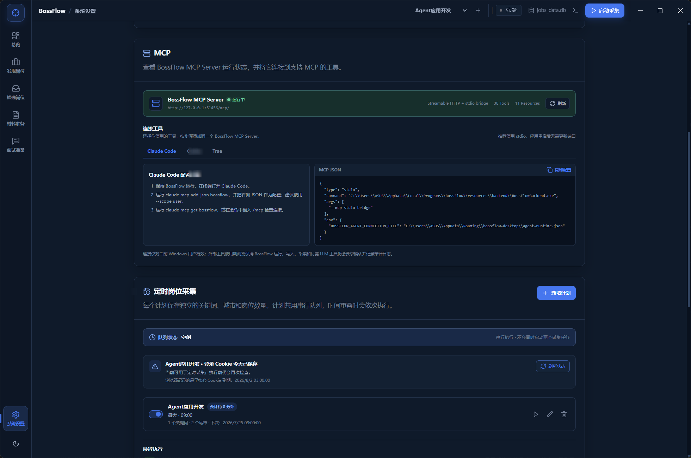
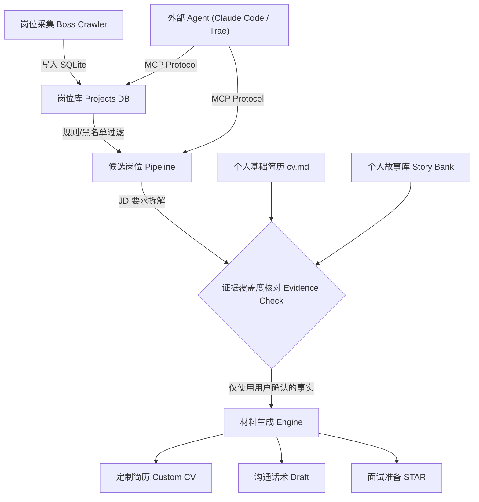

<div align="center">

# 🚀 BossFlow

**本地优先的 AI 求职工作台 | Local-First AI Job Search Workbench**

*把岗位采集、筛选评估、材料准备和面试准备组织为一条可回溯、严谨不编造的工作流。*

[](LICENSE)
[](https://python.org)
[](https://react.dev)
[](https://fastapi.tiangolo.com)
[](BOSSFLOW_MCP_SKILLS_SPEC.md)
[](#-设计边界与隐私承诺)

[核心特性](#-核心特性) • [快速开始](#-快速开始) • [架构设计](#-架构设计) • [MCP--Agent-联动](#-mcp--agent-联动) • [贡献指南](#-贡献指南)

<br/>



</div>

---

## 💡 为什么选择 BossFlow？

传统的求职方式常常面临 **海投效率低下**、**AI 乱编履历被面试官戳穿** 等痛点。

**BossFlow** 重新定义了个人求职流水线：
- 🛡️ **数据完全本地存储**：岗位库、基础简历、证据库与 Cookie 全部保留在你的电脑上，不上传任何第三方云端。
- 🔍 **事实约束型 AI**：AI 绝不假造未确认的经历，每一条简历建议与面试准备都严格基于你的实际证据。
- 📦 **多求职方向隔离**：针对“AI 算法”、“前端开发”、“产品经理”等不同目标，独立隔离岗位库与简历版本。
- 🤖 **本地 MCP 接口支持**：原生支持 MCP 协议，无缝联动 Claude Code, Trae, Codex 等 AI Agent。

---

## ✨ 界面预览与核心特性

### 1. 自动化岗位发现与粗评分数
支持 Boss 直聘自动化采集，设置多城市/关键词、黑名单与规则过滤，按命中技能与薪资匹配度自动粗评分数。


### 2. 候选岗位与履历证据链核对
自动比对 JD 要求与个人真实经历，区分“已有证据”、“待确认”与“技能缺口”，避免 AI 瞎编经历。



### 3. 多格式个人简历导入与维护
支持 **Markdown、文本 (TXT) 及 PDF** 等多种格式的基础简历快速导入与自动解析，便于集中维护核心履历线索。



### 4. 材料定制与能力档案库
基于能力覆盖度生成匹配报告与定制简历 Markdown，能力档案直观展现各技能覆盖岗位数。



### 5. 针对性面试准备与 STAR 故事库
按岗位考察能力点自动生成面试准备文档，将真实项目经历整理为可复用的 STAR 面试故事库。



### 6. 原生 MCP 服务支持与 Agent 联动
内置 Streamable HTTP & stdio 桥接 MCP Server，支持 Claude Code, Trae 等工具直接调用岗位、简历与技能面板。



---

## 📐 架构设计与工作流




---

## 🚀 快速开始

### 环境要求
- **Python**: `3.10+`
- **Node.js**: `18+`
- **Chrome 浏览器**（用于岗位采集和登录 Cookie）

### 1. 克隆项目与安装依赖

```bash
# 克隆仓库
git clone https://github.com/chenyu152/BossFlow.git
cd BossFlow

# 后端依赖
pip install -r requirements.txt

# 前端依赖
cd bossspider-web
npm ci
cd ..
```

### 2. 启动服务

```bash
# 终端 1：后端 (FastAPI)
python -m uvicorn backend.app:app --reload --port 8000

# 终端 2：前端 (Vite)
cd bossspider-web
npm run dev -- --host 127.0.0.1 --port 5173
```

打开浏览器访问：
- Web 工作台: **`http://127.0.0.1:5173/`**
- API 文档: **`http://127.0.0.1:8000/docs`**

### 3. Windows 桌面版 (Electron + Python sidecar)

前端与后端开发服务已启动后，另开终端联调桌面窗口：

```bash
cd desktop
npm ci
npm run dev
```

构建 Windows 发布安装包 (`release/installer/`)：

```bash
cd desktop
npm run dist:win
```

---

## 🔒 设计边界与隐私承诺

1. **绝对本地化 (Local-First)**：所有数据（包含岗位库、基础简历、证据、Cookie）均存放在本机 `projects/` 目录下；不会把简历或证据上传到本项目自己的服务端。
2. **用户在回路 (Human-in-the-Loop)**：LLM 生成的入库规则、评分词库、简历建议、定制简历和故事都需要用户查看、编辑或确认。
3. **真实性第一 (Strict Grounding)**：没有来自简历、用户输入或用户确认事实的内容，不应进入简历或面试材料。
4. **求职方向间完全隔离**：切换求职方向时，不共享基础简历、证据、故事、岗位库或生成材料。

---

## 🧩 本地 MCP (Model Context Protocol) 联动

桌面版打开“系统设置 → MCP”，可查看 Server 的实时状态、工具和资源数量，直接按说明复制对应配置。

仓库内置 3 套可复用 Skills (位于 `.agents/skills/`)：
- 🎯 `triage-new-jobs`：评估新采集的岗位，对比求职目标并加入候选管线
- 📝 `prepare-application`：评估候选角色，核对证据覆盖并准备简历修改建议
- 📚 `import-story-bank`：从代码库或工作日志中提取证据确凿的 STAR 面试故事

详细规格与安全边界请参见 [MCP 与 Skills v1 规格](BOSSFLOW_MCP_SKILLS_SPEC.md)。

---

## 🤝 贡献与反馈

欢迎提交 Issue 或 Pull Request！
- 🐛 提交 Bug / 建议: [GitHub Issues](https://github.com/chenyu152/BossFlow/issues)

---

## 📜 开源协议

本项目采用 [MIT License](LICENSE) 协议开源。
